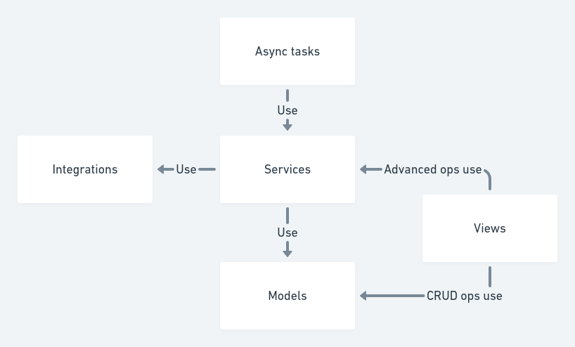
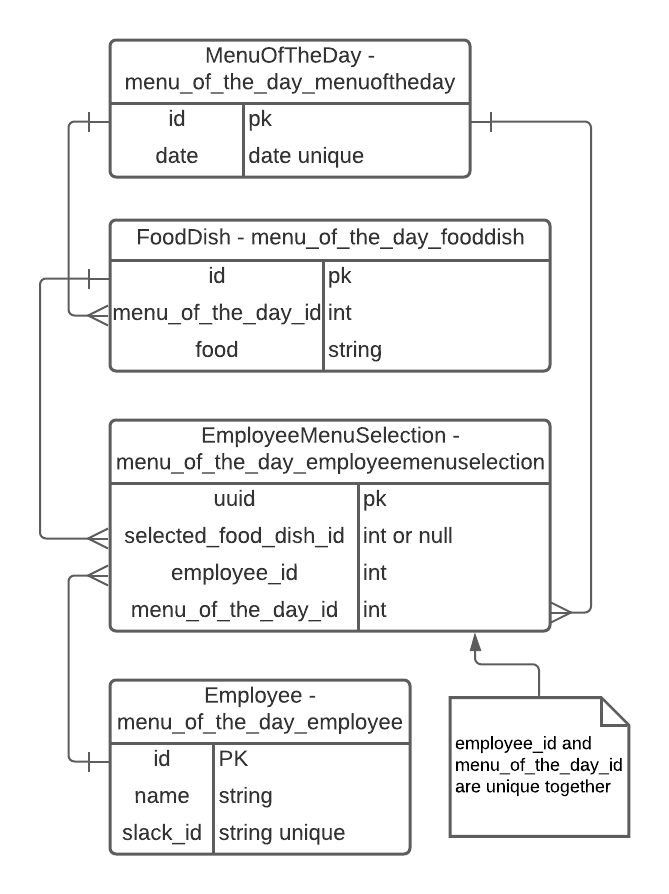

## cornershop-backend-test

### Running the development environment

* `make up` Enter to execute docker build if
it is need and docker compose up.

* `dev up` Enter to run django server.

* `dev celery` Enter to run a celery worker and a celery beat instance at the same time.

##### Rebuilding the base Docker image

* `make rebuild`

##### Resetting the local database

* `make reset`

### Hostnames for accessing the service directly

* Local: http://127.0.0.1:8000


### About building local environment with Linux systems

If you bring up the local environment in a linux system, maybe you can get some problems about users permissions when working with Docker.
So we give you a little procedure to avoid problems with users permissions structure in Linux.:

1- Delete containers

```
# or docker rm -f $(docker ps -aq) if you don't use docker beyond the test
make down
```

2- Give permissions to your system users to use Docker

```
## Where ${USER} is your current user
sudo usermod -aG docker ${USER}
```

3- Confirm current user is in docker group

```
## If you don't see docker in the list, then you possibly need to log off and log in again in your computer.
id -nG
```


4-  Get the current user id

```
## Commonly your user id number is near to 1000
id -u
```

5- Replace user id in Dockerfiles by your current user id

Edit `.docker/Dockerfile_base` and replace 1337 by your user id.

6- Rebuild the local environment

```
make rebuild
make up
```

## .env
- `BACKEND_HOST` At set the env var, start the host with http:// o https://
to see correctly the menu link in slack.
- `TIME_LIMIT_TO_ORDER` Used to limit the time employees can order their menu.
  Format "HH:MM".
- `TIME_TO_SEND_MENU` Time when the menu of the day is sent to employees.
  Format "HH:MM".
- `SLACK_BOT_TOKEN` It is a Bot User OAuth Token with scopes chat:write and
  users:read.

## Concerts
- The time zone used in this project is Chile/Continental that is equal to
  UTC-4 but in summer UTC-3 is in use.

## Architecture


### Services:

Services interacts with models and
handles business logic for the domain.
It depends on Models if it has to
communicate with a datastore and
Integrations if it has to talk to another
domain.

### Models:

Models stores the representation of
data in a datastore. It depends on a
datastore being present.

### Integrations:

This domain consumes other domains
through interfaces. Services depends
on Integrations to communication to other
domains.

### Views:

Originally, Views publishes the service functionality
for other domains to consume. It
depends on Services so it can publish
functionality. But in this case for speed development
Views depends Models. I suggest to use Models directly
for CRUD operations and Services for advance operations.
Nora admin, user interface and the rest api are located here.

### Async tasks:

The async tasks are responsible to execute the
Services at the right time and in the correct
order.

Architecture based on [Django domains](https://phalt.github.io/django-api-domains/).
Some concept names has been changed.

## DB diagram



## Possible improvements
- The id field in the model MenuOfTheDay can be changed by date field
  as PK if you believe it is better.
- Pagination can be added in the future for menus of the day list.
- Improve the display of error messages in the menus admin.
- Disable menu selection changes can be implemented.
- Pytest fixtures aren't used to have type hint in the tests.
- The admin use is_staff User field to allow menus changes, this can be
  changed to use django table "auth_group_permissions".
- The function to get slack can be improved by use pagination.
- Composed keys can be used to improve DB design.
- Limit time to order a food dish should be edited from the db.
- Error management in send_menu_of_the_day_to_employees can be improved.
- A flag of sent can be added to EmployeeMenuSelection.
- Celery beat database should be changed to Django db instead of the file db.
- Services and Integration should be have a abstraction or interface to be easy
  to be changed.
- The func send_message_to_slack_user can be run async in multiple workers to
  improve send_menu_of_the_day_to_employees speed execution.
- The class UpdatableListModelSerializer should be have unit test.
- Improve the documentation related with slack.
- N+1 Queries must be improved.
- Filter in EmployeeMenuSelectionListView can be improved with django-filters.

## Videos

- [Reto técnico Cornershop | Parte 1](https://www.loom.com/share/c50d564ee60f432eba85657bb32fdb7a?sharedAppSource=personal_library)
- [Reto técnico Cornershop | Parte 2](https://www.loom.com/share/93cdc03aab8e4eb591c11ab4ee946a85?sharedAppSource=personal_library)
- [Reto técnico Cornershop | Parte 3](https://www.loom.com/share/55f062fd2b2f4fdcb5335cedbb28da41?sharedAppSource=personal_library)
- [Reto técnico Cornershop | Parte 4](https://www.loom.com/share/75f69df6e28741bb97200508b874dceb?sharedAppSource=personal_library)
- [Reto técnico Cornershop | Parte 5](https://www.loom.com/share/62cecd335df74a5298658e1359f346f2?sharedAppSource=personal_library)

## Bibliography

- [Managing Complexity with Architecture Patterns in Python](https://klaviyo.tech/managing-complexity-with-architecture-patterns-in-python-626b895710ca)
- [Django domains](https://phalt.github.io/django-api-domains/)
